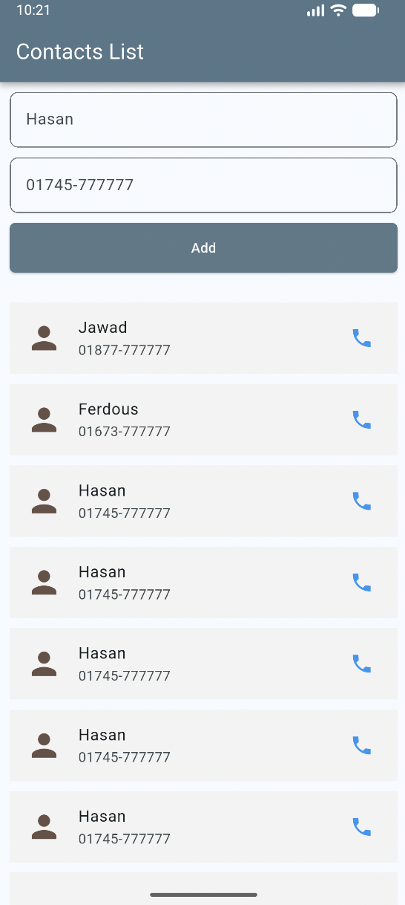

# Contacts List App 📱

একটি সাধারণ এবং সুন্দর **Flutter** অ্যাপ্লিকেশন, যার মাধ্যমে ব্যবহারকারী তার কন্টাক্ট লিস্ট বা ফোন বুক ম্যানেজ করতে পারবেন। অ্যাপটিতে একটি ফর্ম এর মাধ্যমে নতুন নাম ও নম্বর যুক্ত করার সুবিধা এবং নিচে স্ক্রোলযোগ্য কন্টাক্ট লিস্ট দেখার ব্যবস্থা রয়েছে।

## অ্যাপ স্ক্রিনশট (UI Showcase)



---

## বৈশিষ্ট্যসমূহ (Features)

- **সুরক্ষিত লেআউট:** `SafeArea` ব্যবহারের ফলে অ্যাপের কনটেন্ট নোটিফিকেশন বার বা ডিভাইসের নচ (Notch) এর নিচে ঢুকে যায় না।
- **ওভারফ্লো মুক্ত ডিজাইন:** `Expanded` এবং `ListView` এর সমন্বয়ে তৈরি, যার ফলে অনেক বেশি কন্টাক্ট ডাটা থাকলেও কোনো প্রকার `BOTTOM OVERFLOWED` এরর আসে না।
- **রেসপনসিভ বাটন:** পুরো স্ক্রিন জুড়ে বিস্তৃত (Full Width) স্টাইলিশ `ElevatedButton` ব্যবহার করা হয়েছে।
- **ক্লিন ইউজার ইন্টারফেস:** মডার্ন ও মিনিমালিস্টিক কালার প্যালেট এবং রাউন্ডেড কর্নার বর্ডার সম্বলিত ইনপুট ফিল্ড।

---

## প্রযুক্তি (Technologies Used)

- **Framework:** Flutter (Dart)
- **UI Components:** Material Design (`Scaffold`, `Form`, `TextFormField`, `ListView`, `ListTile`)

---

## কীভাবে রান করবেন (How to Run)

আপনার লোকাল মেশিনে প্রজেক্টটি রান করতে নিচের ধাপগুলো অনুসরণ করুন:

১. রিপোজিটরি ক্লোন করুন:
```bash
git clone https://github.com/mazbaul20/Assignment-b19-m7
```

২. প্রজেক্ট ডিরেক্টরিতে যান:
```bash
cd Assignment-b19-m7
```

৩. ফ্লাটার প্যাকেজ বা ডিপেন্ডেন্সিগুলো ইন্সটল করুন:
```bash
flutter pub get
```

৪. অ্যাপটি রান করুন:
```bash
flutter run
```

---

## 📂 কোড আর্কিটেকচার (Core Layout)

অ্যাপটির মূল বডি সেকশনটি নিচে দেওয়া কাঠামো অনুযায়ী সাজানো হয়েছে:

```dart
Scaffold(
  appBar: AppBar(...),
  body: SafeArea(
    child: Column(
      children: [
        Form(...), // ইনপুট নেওয়ার জন্য ফর্ম সেকশন
        Expanded(
          child: ListView(...), // স্ক্রোলযোগ্য কন্টাক্ট লিস্ট সেকশন
        ),
      ],
    ),
  ),
);
```
